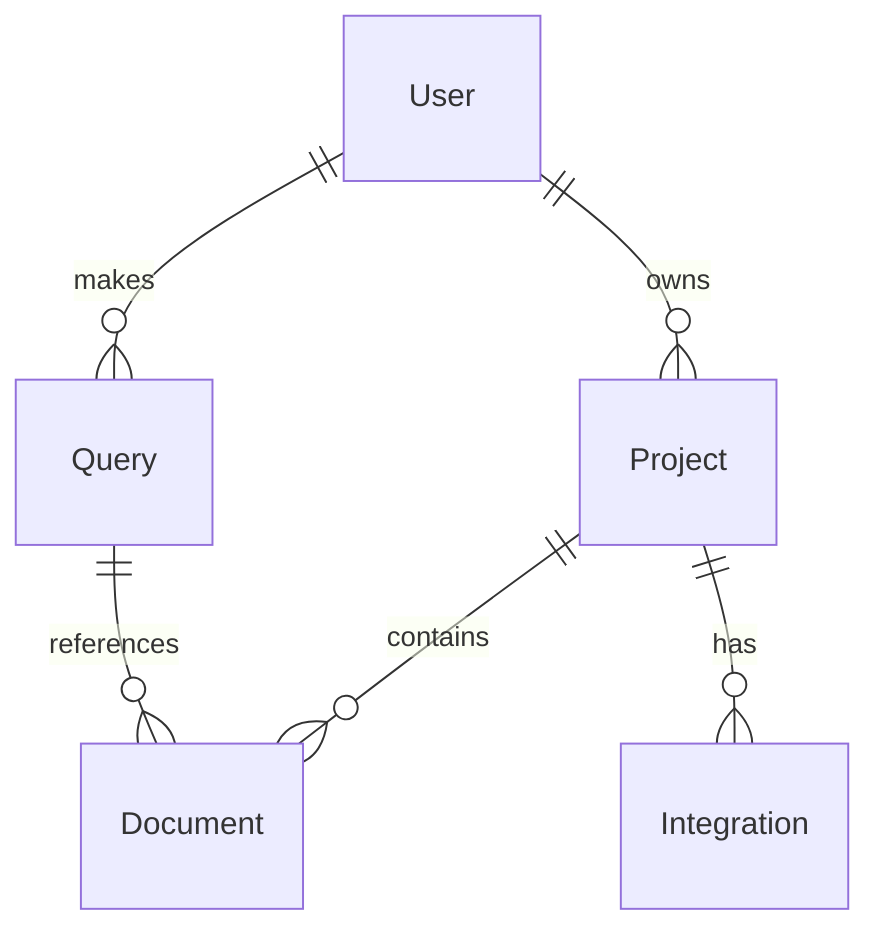

# NeuroSync AI Backend

> AI-powered developer knowledge transfer and project understanding platform

[](https://python.org)
[](https://fastapi.tiangolo.com)
[](LICENSE)

## 🚀 Overview

NeuroSync is an AI-powered platform that revolutionizes developer knowledge transfer and project understanding. It provides intelligent context-aware assistance for development teams through seamless integration with existing tools and workflows.

### Key Features

- **🧠 AI-Powered Query Processing** - Context-aware responses using GPT-4
- **🔍 Semantic Search** - Find relevant information across all project data
- **📊 Multi-Source Data Ingestion** - GitHub, Jira, Slack, Confluence, Notion
- **🔐 Enterprise Security** - JWT authentication, role-based access control
- **💰 Token-Based Pricing** - Flexible usage-based billing model
- **📈 Real-time Analytics** - Usage tracking and performance metrics
- **🌊 Streaming Responses** - Real-time AI query responses
- **🏢 Multi-Tenant Architecture** - Project-based data isolation

## 📋 Prerequisites

- Python 3.9 or higher
- OpenAI API key
- SQLite (default) or PostgreSQL
- Git

## 🛠️ Quick Start

### 1. Clone the Repository

```bash
git clone <repository-url>
cd brain
```

### 2. Install Dependencies

```bash
pip install -r requirements.txt
```

### 3. Configure Environment

```bash
# Copy the example environment file
cp .env.example .env

# Edit .env with your configuration
# At minimum, set your OpenAI API key:
OPENAI_API_KEY=your_openai_api_key_here
```

### 4. Start the Server

```bash
python run.py
```

The server will start on `http://localhost:8000`

### 5. Access API Documentation

- **Swagger UI**: http://localhost:8000/docs
- **ReDoc**: http://localhost:8000/redoc

## 🏗️ Architecture

### Core Components

```
src/
├── api/                 # FastAPI application and routes
│   └── main.py         # Main application entry point
├── config/             # Configuration management
│   └── settings.py     # Environment-based settings
├── database/           # Database connection and management
│   └── connection.py   # SQLAlchemy setup and utilities
├── middleware/         # Authentication and security middleware
│   └── auth.py         # JWT and API key authentication
├── models/             # Data models and schemas
│   ├── database.py     # SQLAlchemy ORM models
│   ├── requests.py     # Pydantic request models
│   └── responses.py    # Pydantic response models
└── services/           # Business logic and external integrations
    ├── ai_service.py   # OpenAI integration and query processing
    ├── auth_service.py # Authentication and authorization
    ├── ingestion_service.py # Multi-source data ingestion
    └── vector_service.py    # ChromaDB vector operations
```

### Technology Stack

- **Framework**: FastAPI
- **Database**: SQLAlchemy (SQLite/PostgreSQL)
- **Vector Store**: ChromaDB
- **AI**: OpenAI GPT-4
- **Authentication**: JWT + Auth0
- **Embeddings**: SentenceTransformers
- **Async**: Python asyncio

## 🔧 Configuration

### Environment Variables

Key configuration options in `.env`:

```bash
# Required
OPENAI_API_KEY=your_openai_api_key_here
JWT_SECRET_KEY=your-super-secret-jwt-key

# Database
DATABASE_URL=sqlite:///./neurosync.db

# Server
HOST=0.0.0.0
PORT=8000
DEBUG=true

# AI Configuration
AI_MODEL=gpt-4
AI_MAX_TOKENS=4000
AI_TEMPERATURE=0.7
```

See `.env.example` for all available options.

## 📡 API Endpoints

### Health Check
```http
GET /health
```

### AI Queries
```http
POST /api/v1/query
POST /api/v1/query/stream
```

### Data Management
```http
POST /api/v1/ingest
POST /api/v1/search
```

### Project Management
```http
POST /api/v1/projects
GET /api/v1/projects
```

## 🔐 Authentication

NeuroSync supports multiple authentication methods:

### JWT Tokens
```http
Authorization: Bearer <jwt_token>
```

### API Keys
```http
X-API-Key: <api_key>
```

### Auth0 Integration
Configure Auth0 settings in `.env` for OAuth2 support.

## 💾 Database Models

### Core Entities

- **Users** - User accounts with subscription tiers
- **Projects** - Multi-tenant project isolation
- **Documents** - Ingested content with metadata
- **Queries** - AI query history and analytics
- **Integrations** - External service connections
- **Usage Logs** - Token usage and billing data

### Relationships



## 🔌 Integrations

### Supported Data Sources

- **GitHub** - Repositories, issues, pull requests
- **Jira** - Tickets, comments, attachments
- **Slack** - Messages, threads, files
- **Confluence** - Pages, spaces, attachments
- **Notion** - Pages, databases, blocks
- **Meetings** - Transcripts and recordings

### Adding New Integrations

1. Implement data source handler in `ingestion_service.py`
2. Add authentication configuration
3. Update request/response models
4. Test with sample data

## 🧪 Testing

```bash
# Run tests
python -m pytest tests/

# Run with coverage
python -m pytest tests/ --cov=src/

# Run specific test file
python -m pytest tests/test_api.py
```

## 🚀 Deployment

### Docker Deployment

```dockerfile
FROM python:3.9-slim

WORKDIR /app
COPY requirements.txt .
RUN pip install -r requirements.txt

COPY . .
EXPOSE 8000

CMD ["python", "run.py"]
```

### Production Considerations

- Use PostgreSQL for production database
- Configure Redis for caching and rate limiting
- Set up proper logging and monitoring
- Use environment-specific settings
- Enable HTTPS and security headers

## 📊 Monitoring

### Health Checks

The `/health` endpoint provides system status:

```json
{
  "status": "healthy",
  "version": "1.0.0",
  "services": {
    "database": "healthy",
    "vector_store": "healthy",
    "ai_service": "healthy"
  }
}
```

### Logging

Structured logging with configurable levels:

```python
# Log levels: DEBUG, INFO, WARNING, ERROR, CRITICAL
LOG_LEVEL=INFO
LOG_FORMAT=json
```

## 💰 Pricing Model

### Subscription Tiers

- **Starter** ($19/month) - 3 projects, 5 users, 1000 tokens
- **Professional** ($29/month) - 10 projects, 15 users, 5000 tokens
- **Enterprise** ($49/month) - Unlimited projects, 50 users, 15000 tokens

### Token Usage

- AI Query: ~10 tokens
- Data Ingestion: ~5 tokens
- Code Analysis: ~15 tokens

### Token Packs (Add-ons)

- Small Pack: 1000 tokens - $5
- Medium Pack: 5000 tokens - $20
- Large Pack: 15000 tokens - $50
- Enterprise Pack: 50000 tokens - $150

## 🤝 Contributing

1. Fork the repository
2. Create a feature branch (`git checkout -b feature/amazing-feature`)
3. Commit your changes (`git commit -m 'Add amazing feature'`)
4. Push to the branch (`git push origin feature/amazing-feature`)
5. Open a Pull Request

## 📝 License

This project is licensed under the MIT License - see the [LICENSE](LICENSE) file for details.

## 🆘 Support

- **Documentation**: [docs.neurosync.ai](https://docs.neurosync.ai)
- **Issues**: [GitHub Issues](https://github.com/neurosync/backend/issues)
- **Email**: support@neurosync.ai
- **Discord**: [NeuroSync Community](https://discord.gg/neurosync)

## 🎯 Roadmap

### Phase 1 ✅ (Current)
- Core AI backend infrastructure
- Multi-source data ingestion
- Authentication and authorization
- Basic API endpoints

### Phase 2 🚧 (Next)
- Frontend web application
- Real-time collaboration features
- Advanced analytics dashboard
- Mobile application

### Phase 3 📋 (Future)
- Enterprise SSO integration
- Advanced AI models
- Custom model training
- API marketplace

---

**Built with ❤️ by the NeuroSync Team**
